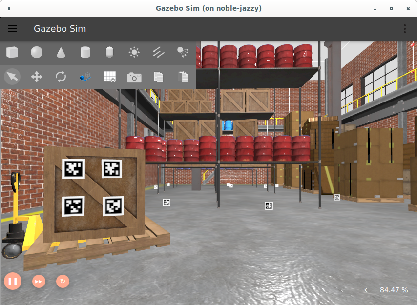

# gazebo_apriltag



Generates AprilTag models compatible with Gazebo Harmonic.

Configure the number and size of tags you'd like to generate by setting `TAG_COUNT` and `TAG_SIZE_PIX`.

Install models by running:
```bash
cp -R gazebo_apriltag/models/* ~/.gazebo/models/
```

Or, add the full path to `gazebo_apriltag/models/` to the `GZ_SIM_RESOURCE_PATH` environment variable.
You can then insert them into your gazebo world via the Resource Spawner.

H/T to [koide3](https://github.com/koide3/gazebo_apriltag) for creating the original version of this repo.
